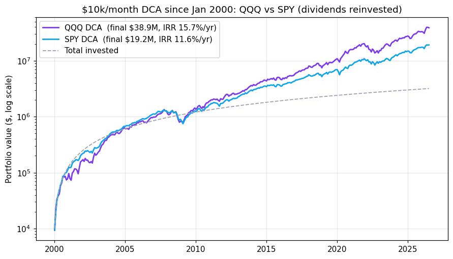

# qqq-vs-spy

**What is it?** A backtest answering one question: if you invested **$10,000 every month**, would you have done better with **QQQ (Nasdaq-100)** or **SPY (S&P 500)**? Uses real, dividend-adjusted monthly data from Yahoo Finance (1999–2026).

## How to run

```bash
pip install -r requirements.txt
python dca_backtest.py
```

The script downloads fresh data from Yahoo Finance (and falls back to the snapshot in `data/etf_monthly.csv` if offline), runs the backtest from five start years, prints the results, and saves `chart.png` comparing the two portfolio curves.

## Result

QQQ wins at **every** start year — higher return with only slightly deeper drawdowns:

| Start | QQQ IRR | SPY IRR | QQQ final / SPY final | QQQ maxDD | SPY maxDD |
|-------|--------:|--------:|----------------------:|----------:|----------:|
| 2000  | 15.7%   | 11.6%   | 2.03x                 | -49%      | -47%      |
| 2005  | 18.1%   | 13.2%   | 1.95x                 | -43%      | -38%      |
| 2010  | 20.0%   | 14.8%   | 1.66x                 | -35%      | -31%      |
| 2015  | 20.9%   | 15.5%   | 1.41x                 | -32%      | -30%      |
| 2020  | 21.9%   | 17.4%   | 1.16x                 | -20%      | -17%      |

Average IRR across the five starts: **QQQ 19.3%/yr vs SPY 14.5%/yr**.



**One honest caveat:** almost all of QQQ's edge comes from the post-2010 tech bull market. During 2000–2009, QQQ returned **-6.9%/yr** vs SPY's -1.1%/yr. Over the full 26 years, buy-and-hold returns differ by only ~0.4pp/yr — DCA amplifies QQQ's edge here only because most contributions landed in the tech-winning decade. Past performance is not a law of nature.

*Not investment advice.*
